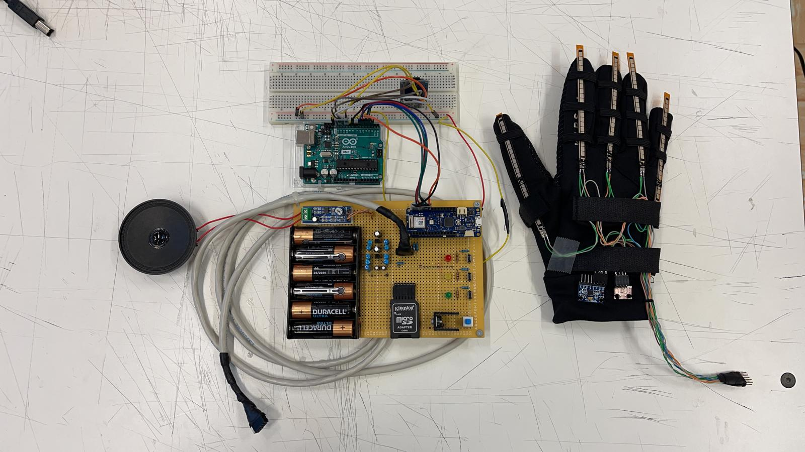

# 🧤 taLkIg-gloveS: Smart Glove for Italian Sign Language Recognition (LIS) 
This project involves the development of an Arduino-based smart glove designed to recognize gestures in Italian Sign Language (LIS) and "speak" the mimicked word through a speaker.



---

## 🚀 Project Overview
The system combines a set of sensors and two interconnected Arduino boards to accurately capture hand movements and recognize predefined gestures. The recognized gestures are mapped to words, which are then pronounced through an integrated audio system.

---

## ✨ Key Features:
🎛️ **Flex Sensors**: Capture finger bending data.

📊 **MPU6050 Accelerometer**: Detect hand orientation and movement.

🌡️ **BMP280 Sensor**: Measure altitude to enhance gesture accuracy.

🔊 **Audio Output**: Plays pre-recorded phrases based on recognized gestures.

🔧 **Hardware Components**
- Arduino Arduino Nano 33 IoT (1010)
- Arduino Uno for Audio Playback
- Flex Sensors (5 units)
- BMP280 Altitude Sensor
- MPU6050 Accelerometer
- MicroSD Module
- Speaker

🔌**Wiring Diagram** in the PDF presentation inside the folder

---

## 🛠️ Software Implementation

The system consists of two Arduino scripts running on separate boards:

### 1️⃣ Core Arduino Script

- Reads sensor data (flex, altitude, and accelerometer)
- Processes the detected gesture by comparing it to a predefined word dataset
- Sends the identified word to the audio module using binary communication

### 2️⃣ Audio Arduino Script
Receives binary-coded signals from the core Arduino
Plays pre-recorded audio corresponding to the recognized gesture

---

## 📂 Repository Structure  
```
├── Check_sensori  
│   ├── I2c_scanner.ino  
│   └── Test_sensori_nuovo.ino  
├── Codice   
│   ├── Arduino.ino
│   └── Arduino1010.ino  
└── Presentazione_BabyYodini.pdf
```

In the folder **Check_sensori** there are some scripts that checks if all the wiring have been done correctly.

In the folder **Codice** there are the two scripts for the two respective Arduino board.

The file **Presentazione_BabyYodini** is the pdf version of a dynamic presentation we did at the hackathon where we built our project.

---

## 🛠️ Installation & Usage

### Prerequisites:
Arduino IDE

Necessary libraries: TMRpcm, Adafruit_BMP280, Wire, SD, MPU6050_tockn

### Steps:
Clone this repository:

```
git clone https://github.com/your-repo-url
cd your-repo-folder
```

- Upload the respective scripts to the Core Arduino and Audio Arduino modules.
- Connect the hardware components following the provided wiring diagram.
- Power up the system and test gesture recognition!

---

## 🎙️ How It Works:
- User Gesture: Mimic a predefined word using LIS gestures.
- Sensor Data Collection: Flex sensors, accelerometer, and altitude data are recorded.
- Data Processing: Core Arduino compares the gesture to a predefined dataset.
- Audio Playback: Audio Arduino outputs the correct audio phrase.

---

## 📚 Acknowledgements
This project was developed by Diego Quattrone and Andrea Scarpellini.

---

## 🧑‍💻 Contributing
Feel free to submit pull requests or report any issues! Let's improve this together.
